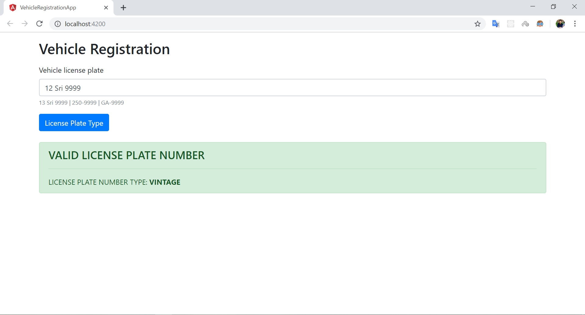
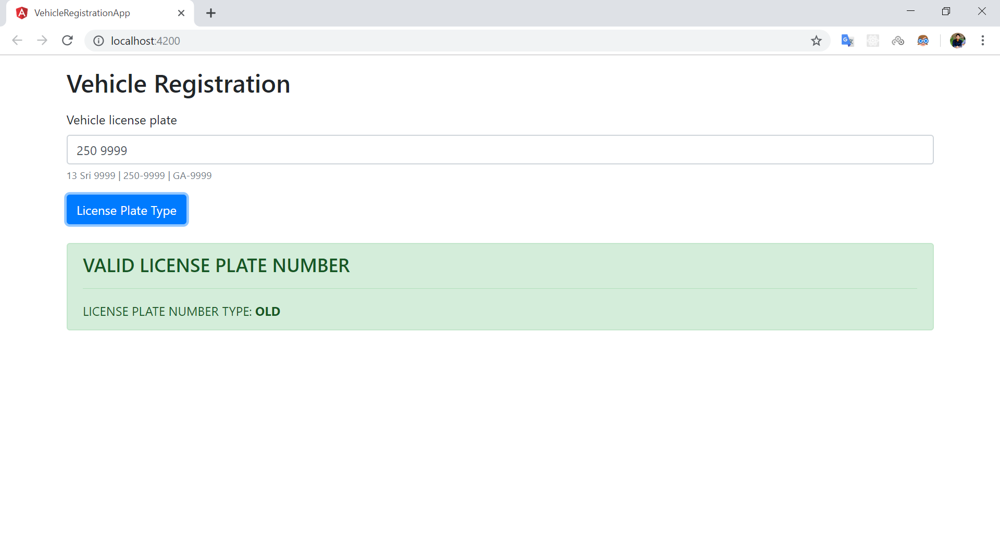
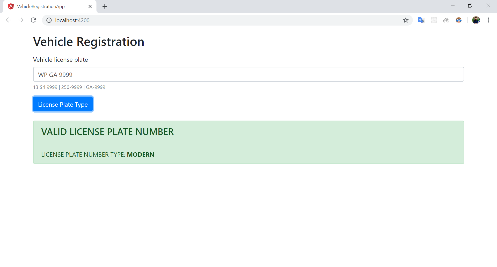
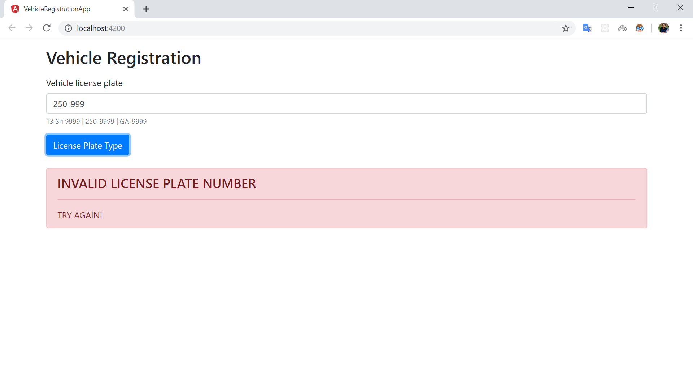

# VEHICLE REGISTRATION APP - ANGULAR

```
Develop the vehicle registration web application for validate and determine the license plate number type using ANGULAR.
```

## Method

> First, clone or download the source code from github

> Then, goto the root directory and install the node modules using `npm install` 

> Finally, run the application using `ng serve --open` :+1:.

## Screenshots









## Demo

https://sathveegan.github.io/Vehicle-Registration-App-Angular/